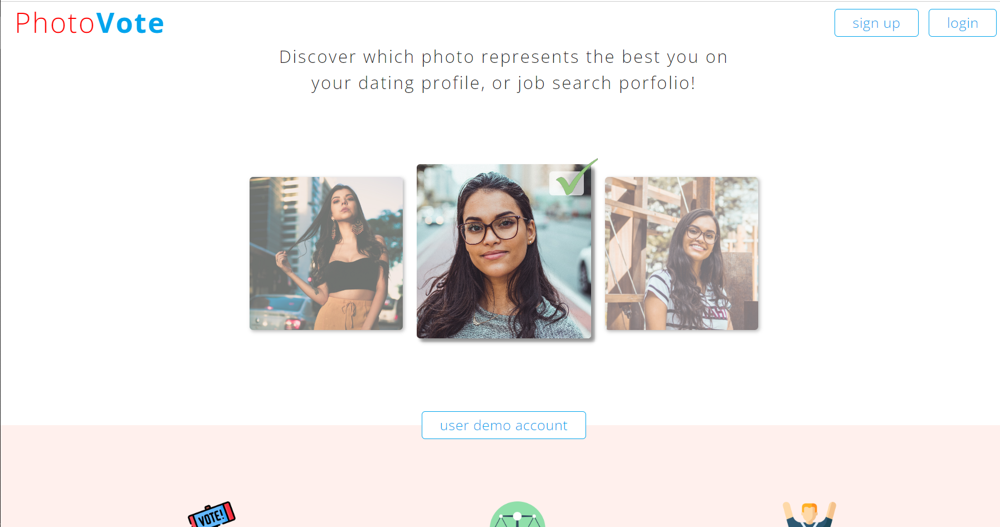
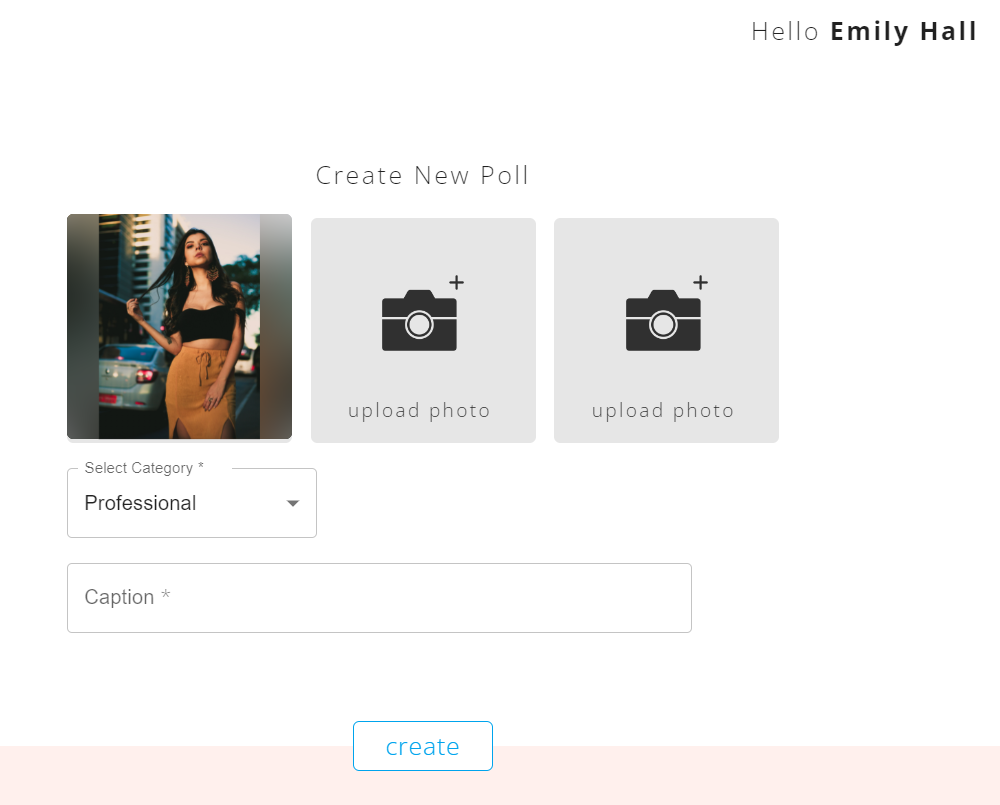
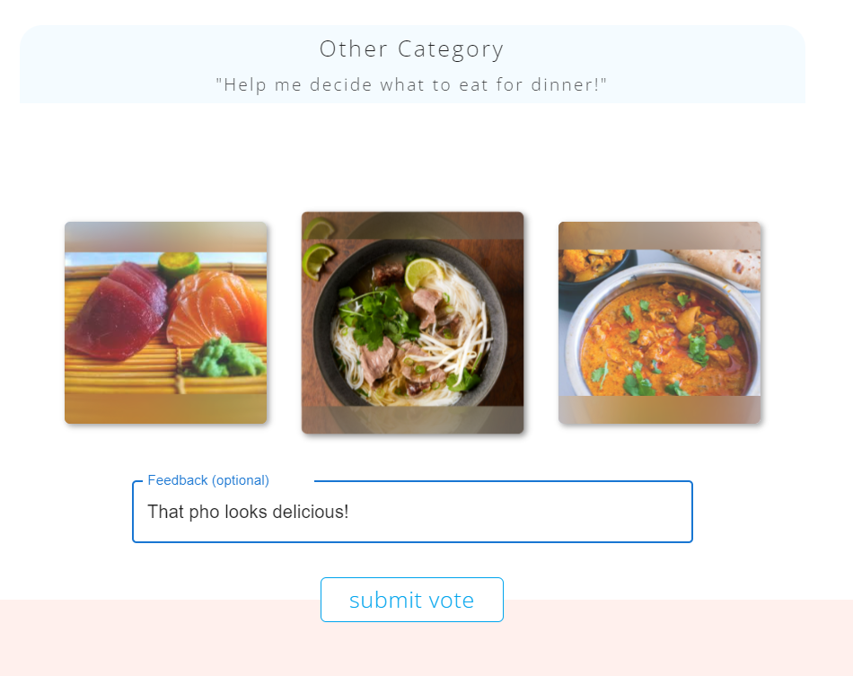
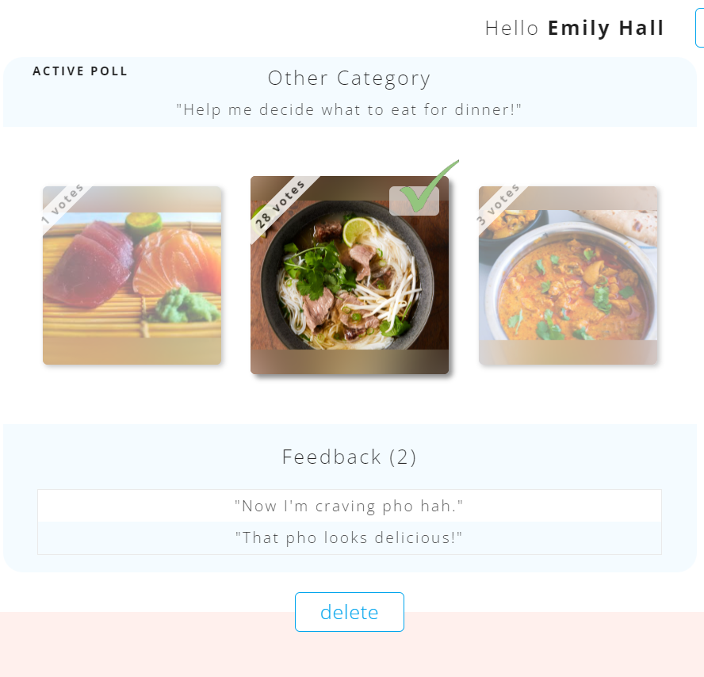
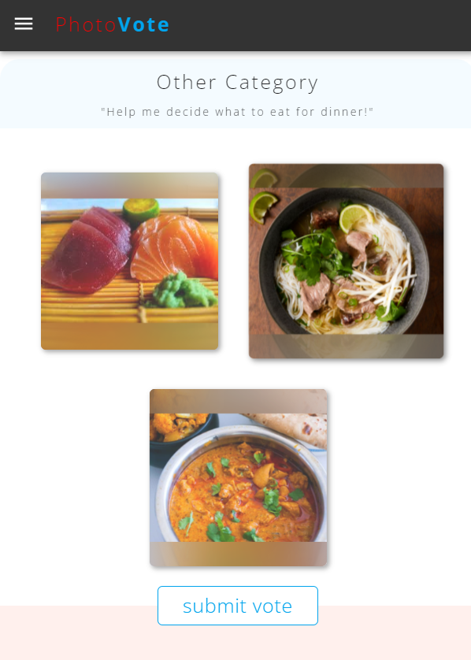

## About PhotoVote

Upload 3 photos and let the PhotoVote community vote which one is best for the occasion. PhotoVote is a full-stack demo project for my [portfolio](https://woox99.github.io/Portfolio/). Quickly access the full functionality of the website with a Demo Account [here](http://3.143.25.6/).

## Build Stack
              

## Features

#### Security 🔒

User Authentication & Authorization
* Password ***hashing***
* Registration ***validation***
* Route protection
* [Demo Account](http://3.143.25.6/)

--- 

#### File Storage

 

* PhotoVote uses Multer middleware integration for handling ***photo uploads*** and storing the photo data as a buffer in memory. 
* ***Upload*** 3 photos smaller than 1MB each.
* Include a ***caption*** so your audience knows the context for which you intend to use the photos for.

---

#### Voting & Karma

 

* ***Vote*** on other user's polls to earn ***Karma Points***. You don't need Karma to create a poll, however, users with Karma will always get their polls voted on first. 
* ***Leave feedback*** if you want to pass a message on to the poll's author.

---
#### Results

 

* Once you create an active poll, allow time for the ***results*** and visit back to see which photo received the most votes and read feedback messages the audience sent you. 
* ***Delete*** the poll and create a new one at anytime. 

---
#### Responsiveness

 

* ***Responsive*** design to fit any device.

---

 

***Adminstrative*** dashboard for approved users to manage user activity.

* Delete inappropriate content
* Ban rule breakers
* Catalog user statistics and activity